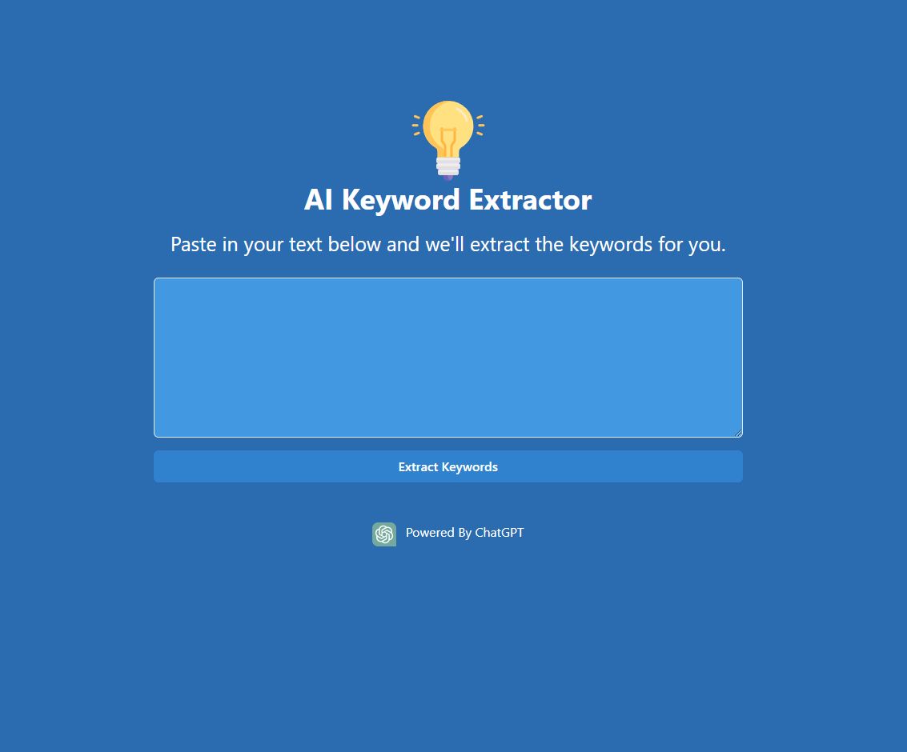

# AI Keyword Extractor

This is a simple tool built with React and Chakra UI that uses the Open AI [chat completion API](https://platform.openai.com/docs/guides/completion) to extract the best keywords from any given text.

<div style="text-align:center">

</div>

## How to use

Install dependencies:

```bash
npm install
```

Rename `.env.example` to `.env` and add your API key. You can get your key at [https://platform.openai.com/account/api-keys](https://platform.openai.com/account/api-keys).

```bash
VITE_OPENAI_API_KEY='ADD_YOUR_KEY_HERE'
```

Important: Your API key is not secure as there is no backend. If you decide to use this tool in production, you should add a backend to it and store the API key there.

Run the dev server:

```bash
npm run dev
```

Open [http://localhost:3000](http://localhost:3000) with your browser to see the result.

To build for production:

```bash
npm run build
```

## License

MIT License

## Project Overview

**UofT-CourseSync** is a website designed to assist students at the University of Toronto in managing their coursework. The platform serves multiple purposes:

### Course Management

- Students can create accounts on the website.
- Once logged in, they can add the courses they are enrolled in.
- The website securely stores this information, allowing students to access it anytime.

### Assignment and Test Tracking

- The website extracts information from course syllabi, such as assignments, tests, and their due dates.
- This information is displayed on the website, and students can also have it automatically added to their personal calendars (such as Google Calendar).

### Grade Calculation

- The website extracts the weight of each assignment and test from the syllabus.
- Students can enter the scores they received on each assignment and test.
- Based on the entered scores and the weight of each component, the website calculates the student’s current grade in the course.


## How to use

Install dependencies:

```bash
npm install
```

Run the dev server:

```bash
npm run dev
```

Open [http://localhost:3000](http://localhost:3000) with your browser to see the result.

To build for production:

```bash
npm run build
```

## License

MIT License
